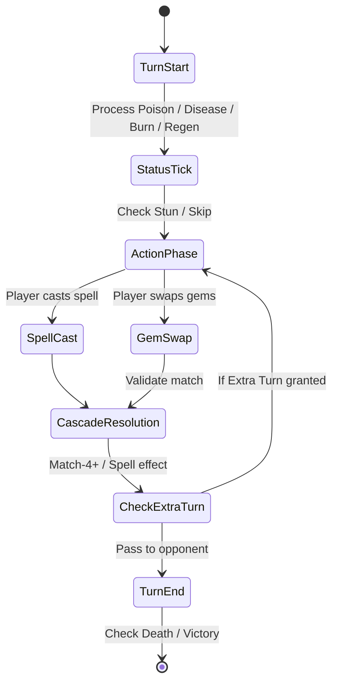

# Puzzle Quest: Game Knowledge Base, Mechanics & Engine Hypotheses

This document records the gameplay rules, mathematical systems, data structures, and engine patterns of *Puzzle Quest: Challenge of the Warlords*. It serves as our reference when analyzing decompiled functions in Ghidra and forming reverse-engineering hypotheses.

---

## 1. Board & Match-3 Mechanics

### Grid Structure
* **Dimensions**: $8 \times 8$ grid (64 tiles total).
* Coordinate system in Lua/C: typically $(x, y)$ with $0 \le x \le 7$ and $0 \le y \le 7$ (or 1-indexed in Lua wrappers; we need to verify indexing conventions in `GET_GEM(x, y)`).

### Gem Types & IDs
The engine recognizes several core gem types (referenced in Lua and C):
1. **Mana Gems**:
   * **Earth (Green)**: Yields Green Mana (Earth Mastery).
   * **Fire (Red)**: Yields Red Mana (Fire Mastery).
   * **Water (Blue)**: Yields Blue Mana (Water Mastery).
   * **Air (Yellow)**: Yields Yellow Mana (Air Mastery).
2. **Resource Gems**:
   * **Gold (Coins)**: Adds Gold (+1 per coin, modified by equipment/perks).
   * **Experience (Purple stars)**: Adds XP (+1 per gem, modified by perks).
3. **Damage / Combat Gems**:
   * **Skull**: Deals 1 damage per skull (boosted by Battle skill and hero/enemy bonuses).
   * **+5 Skull (Explosive / Heavy Skull)**: Deals 5 base damage + regular skull damage, and can deal damage to surrounding tiles when destroyed.
4. **Multiplier / Wildcard Gems**:
   * Multiplier gems ($+2\text{x}$, $+3\text{x}$, $+4\text{x}$, $+5\text{x}$, etc.) created when 5 or more gems match. Can substitute for any mana gem in a match and multiply the resulting mana or effect.

### Match & Move Rules
* **Valid Move**: Two orthogonal adjacent gems may be swapped. A swap is valid **if and only if** it creates a match of 3 or more of the same type (or substitutes with a wildcard).
* **Illegal Move Penalty**: If a player attempts an invalid swap, the gems swap back. In certain modes or difficulties, an illegal move might incur a penalty (mana drain or damage), though in standard PC Puzzle Quest it simply snaps back.
* **4-of-a-Kind**:
   * Clears the 4 matched gems.
   * Awards an **Extra Turn** (`EXTRA_TURN()` in Lua).
   * Grants normal gem yields.
* **5-of-a-Kind (or more)**:
   * Clears the matched gems.
   * Spawns a **Wildcard / Multiplier Gem** at the match junction point.
   * Awards an **Extra Turn**.
* **Cascades & Gravity**:
   * Matched gems are marked for destruction (`DESTROY_GEM`).
   * Gems above fall down column by column (gravity).
   * New gems spawn at the top row (generated by pseudo-random generation or scripted sequence in puzzles).
   * Cascade matches trigger recursively until the board is stable.
* **Mana Surges**:
   * High elemental masteries grant a percentage chance of a **Mana Surge** (+3 bonus mana when matching that color).

---

## 2. Character Stats & Combat Flow

### The Seven Core Attributes
1. **Earth Mastery**: Starting earth mana, max earth mana cap, earth mana surge chance, resistance to earth spells.
2. **Fire Mastery**: Starting fire mana, max fire mana cap, fire mana surge chance, resistance to fire spells.
3. **Water Mastery**: Starting water mana, max water mana cap, water mana surge chance, resistance to water spells.
4. **Air Mastery**: Starting air mana, max air mana cap, air mana surge chance, resistance to air spells.
5. **Battle**: Increases damage dealt by Skulls and weapon attacks.
6. **Morale**: Increases maximum Life (HP) and adds to elemental resistances.
7. **Cunning**: Determines who takes the first turn at battle start; increases gold/wildcard chances; contributes to trap disarm and enemy capture.

### Turn Sequence State Machine


### Status Effects
Recognized status effects tracked on combatants (`ADD_STATUS_EFFECT`, `CLEAR_STATUS_EFFECTS`):
* **Poison**: Deals damage directly to HP at the start of each turn.
* **Disease**: Drains mana each turn.
* **Burn**: Fire damage over time.
* **Web / Entangle**: Restricts physical or green mana moves.
* **Silence**: Prevents casting spells.
* **Stun**: Skips the affected combatant's next turn.
* **Blind**: Reduces combat damage / accuracy.

---

## 3. Mini-Games & Puzzle Variants

1. **Spell Research**:
   * Solve a pre-arranged board configuration where all gems must be completely cleared.
   * Moves are strictly limited.
2. **Mount Training**:
   * Clear a specified quota of gems (e.g., green mana or skulls) before the timer or turn limit expires.
3. **Item Forging (Citadel)**:
   * Match runes together without letting any illegal moves occur or failing the forge conditions.
4. **Capturing Monsters**:
   * A puzzle board where matching clears the board to 0 gems, capturing the monster for use as a mount or for learning spells.
5. **City Sieges**:
   * Special battle rules against city defenses/structures.

---

## 4. Reverse-Engineering Hypotheses & Patterns to Search For

### A. Memory Patterns & MSVC 7.1 Specifics
* **Compiler**: Visual C++ .NET 2003 (MSVC 7.1).
* **Calling Convention**: `__thiscall` for C++ class member functions (`ECX = this`), `__cdecl` for Lua C-API callback functions (`int (*lua_CFunction)(lua_State *L)`), `__stdcall` for Windows API and DLL exports.
* **Strings**: Wide strings (`wchar_t*` / UTF-16LE) are heavily used for UI texts, paths, and identifiers, while Lua bindings use ASCII strings (`char*`).
* **Memory Management**: Custom heap / allocator or standard MSVCR71 `malloc` / `operator new`.

### B. Lua C-API Function Bridge Pattern
In Lua 5.1, functions are registered via:
```c
lua_register(L, "FUNCTION_NAME", c_function_ptr);
// or luaL_register(L, NULL, reg_table);
```
Where each `reg_table` entry is a pair:
```c
struct luaL_Reg {
    const char *name;
    lua_CFunction func;
};
```
* **Hypothesis**: In `Puzzle Quest.exe`, there is an array of `struct { const char *name; void *func_ptr; }` containing all 163 exported functions (e.g. `"GET_GEM"`, `"ADD_LIFE"`). Locating the cross-references to these string literals will immediately reveal this table and the corresponding function pointers.

### C. Board Class (`CBoard` / `CGrid`)
* Contains an array of 64 gem structs or ints (`int m_grid[8][8]` or `CGem m_grid[8][8]`).
* Holds gem swap animation states, fall velocities, cascade combo counter (`m_nCombo`).
* Methods to look for:
  * `CanSwap(int x1, int y1, int x2, int y2) -> bool`
  * `Swap(int x1, int y1, int x2, int y2)`
  * `CheckMatches() -> int`
  * `DestroyGems(...)`
  * `ApplyGravity()`
  * `FillEmpty()`
  * `EvaluateBoard(...) -> int` (the AI evaluation engine).

### D. Combatant / Character Class (`CCharacter` / `CHero`)
* Member fields:
  * `int m_life, m_maxLife`
  * `int m_mana[4], m_maxMana[4]` (Earth, Fire, Water, Air)
  * `int m_skills[7]` (Earth, Fire, Water, Air, Battle, Morale, Cunning)
  * `int m_gold, m_xp, m_level`
  * Inventory item arrays / pointers.
  * Active status effect linked list or array (`StatusEffect m_statusEffects[]`).
